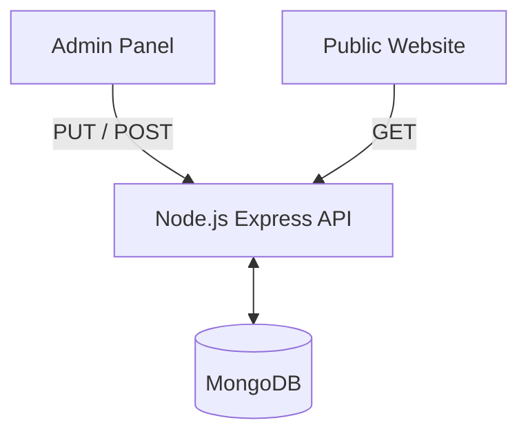

# Dynamic Architecture Implementation Plan

## Objective
Convert the current static React application into a fully dynamic, database-driven platform with a separate Admin Panel for content management.

## Tech Stack
- **Database:** MongoDB (using Mongoose)
- **Backend:** Node.js + Express.js
- **Admin App:** React + Vite
- **Client App:** React + Vite (Existing `web-app`)

## Phases

### Phase 1: Foundation (Completed)
- [x] Create `backend` directory.
- [x] Initialize Node.js, Express, Mongoose, and Multer for image uploads.
- [x] Define `SiteContent` database schema to store global data (Hero text, Social Links, Services, Gallery).
- [x] Setup `admin-app` with React and Vite.
- [x] Build basic Admin Dashboard UI connecting to the Backend.

### Phase 2: Backend Development (Next Steps)
- [ ] Implement fully dynamic schemas for Services, Portfolio Images, Team Members, and Reviews.
- [ ] Add Image Upload endpoints to handle gallery files.
- [ ] Setup Authentication (JWT) so only the admin can access the panel.

### Phase 3: Admin App Expansion
- [ ] Create specialized panels:
  - Settings (Logos, Contact info, Social media)
  - Home Page Configuration (Hero Text, Stats)
  - Portfolio Manager (Upload new creations, delete old ones)
  - Review Manager (Add/Edit testimonials)
  - Services Manager (Add/Edit service offerings)

### Phase 4: Web App Integration
- [ ] Install `axios` in `web-app`.
- [ ] Create a central `GlobalContext` to fetch all data from the Backend on initial load.
- [ ] Replace static text in `Home.jsx`, `Services.jsx`, `Gallery.jsx`, and `About.jsx` with dynamic state variables from the database.

## Architecture Diagram

